# 🔄 Flujo de Desarrollo de Productos con IA

## Flujo Principal

### Diagrama del Proceso

```mermaid
graph TD
    A[1. Seleccionar idea de brainstorm_productos.md] --> B[2. Procesar con Perplexity AI]
    B --> C[3. Crear carpeta del producto]
    C --> D[4. Generar documentación con IA]
    D --> E[5. Validar y refinar]
    E --> F[6. Producto documentado]
    
    style A fill:#f9f,stroke:#333,stroke-width:2px
    style F fill:#9f9,stroke:#333,stroke-width:2px
```



### Resumen de Pasos

1. **Seleccionar idea** del archivo brainstorm_productos.md
2. **Procesar con Perplexity AI** para análisis inicial
3. **Crear carpeta** con estructura estándar
4. **Generar documentación** usando IA para cada aspecto
5. **Validar y refinar** según criterios establecidos
6. **Producto documentado** listo para desarrollo

## Paso 1: Selección de Idea

**Archivo fuente**: `core_ideas/brainstorm_productos.md`

**Acción**: Elegir una idea basándose en:
- Servicios PDI disponibles
- Potencial de mercado
- Complejidad técnica

## Paso 2: Análisis con Perplexity AI

**Prompt para Perplexity**:
```
Procesá esta idea: [NOMBRE_PRODUCTO]

Contexto: Producto que integra con la PDI del Estado uruguayo para [DESCRIPCIÓN]

Necesito:
1. Funcionalidades clave
2. Servicios PDI requeridos (de servicios_pdi_consolidado.xlsx)
3. Diagrama Mermaid del flujo
4. Entidades involucradas
5. Tiempos estimados
6. Evaluación de viabilidad
```

**Output**: `analisis_perplexity.md`

## Paso 3: Crear Estructura

**Comando**: Crear carpeta `XX. 🎯 [Nombre Producto]/`

**Estructura**:
```
XX. 🎯 [Nombre Producto]/
├── analisis_perplexity.md
├── investigacion_mercado.md
├── especificaciones_tecnicas.md
└── modelo_negocio.md
```

## Paso 4: Desarrollo con IA

### 4.1 Investigación de Mercado

**Prompt**:
```
Investiga el mercado uruguayo para [PRODUCTO]:
- Tamaño del mercado
- Competencia
- Pain points
- Usuarios target
```

### 4.2 Especificaciones Técnicas

**Prompt**:
```
Genera especificaciones técnicas:
- Arquitectura
- Integraciones PDI
- Stack tecnológico
- User stories
```

### 4.3 Modelo de Negocio

**Prompt**:
```
Desarrolla modelo de negocio:
- Propuesta de valor
- Estrategia de monetización
- Go-to-market
- KPIs
```

## Paso 5: Validación

### Proceso de Validación

```mermaid
graph LR
    A[Documentación completa] --> B{Validar}
    B --> C[Servicios PDI activos]
    B --> D[Mercado > 1000 empresas]
    B --> E[ROI > 300%]
    C --> F{OK?}
    D --> F
    E --> F
    F -->|Sí| G[Aprobado]
    F -->|No| H[Refinar]
    H --> A
```



### Criterios de Validación

- ✓ **Servicios PDI**: Todos los servicios deben estar activos
- ✓ **Tamaño de mercado**: Mínimo 1000 empresas potenciales
- ✓ **ROI proyectado**: Superior al 300% para clientes

## Paso 6: Documentación Final

**Estructura del documento final**:
1. Executive Summary
2. Problema y Solución
3. Arquitectura Técnica
4. Funcionalidades con PDI
5. Modelo de Negocio
6. Roadmap

## Ejemplo Práctico: ContaBot AI

### Flujo de Desarrollo ContaBot


### Resultados del Ejemplo

- **Servicios PDI identificados**: DGI (RUT, Certificados), BPS (Aportes)
- **Mercado objetivo**: 54,800 empresas en Uruguay
- **Documentos generados**: análisis, especificaciones, modelo de negocio
- **Tiempo total**: 3.5 horas

## Tiempos Estimados

- **Paso 1**: 15 minutos
- **Paso 2**: 30 minutos
- **Paso 3**: 5 minutos
- **Paso 4**: 2-3 horas
- **Paso 5**: 30 minutos
- **Total**: ~4 horas por producto

## Herramientas Necesarias

1. **Perplexity AI** (configurado con space "Product Flow x1000")
2. **Claude/ChatGPT** (para documentación detallada)
3. **Acceso a archivos**:
   - `servicios_pdi_consolidado.xlsx`
   - `brainstorm_productos.md`
   - `entidades_servicios.md`

## Criterios de Éxito

- ✅ Documentación completa en 4 horas
- ✅ Todos los servicios PDI validados
- ✅ Modelo de negocio claro
- ✅ Arquitectura técnica definida
- ✅ ROI cuantificable para clientes 